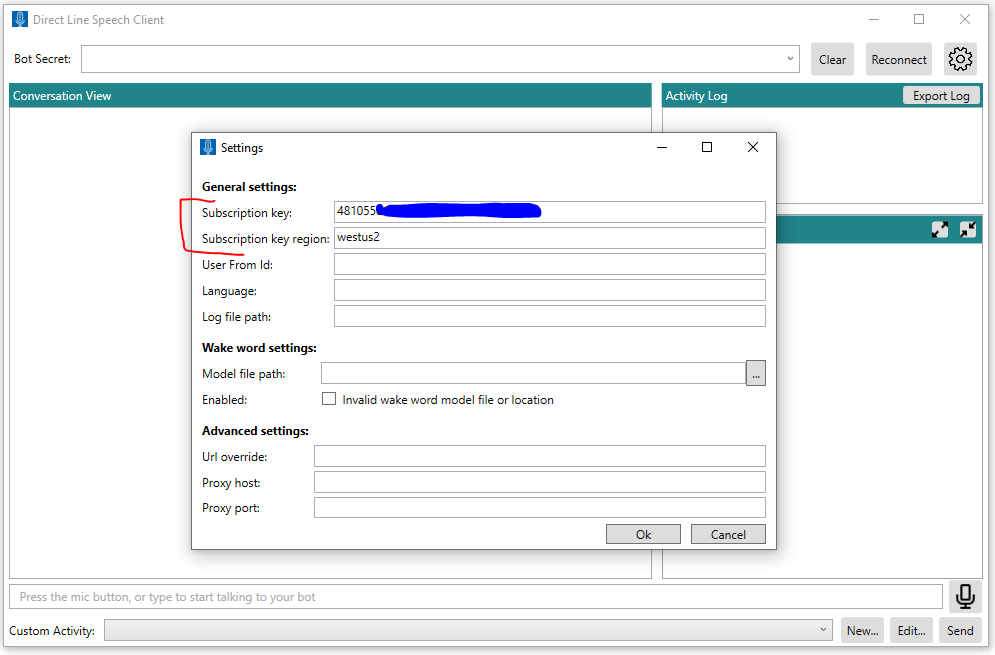
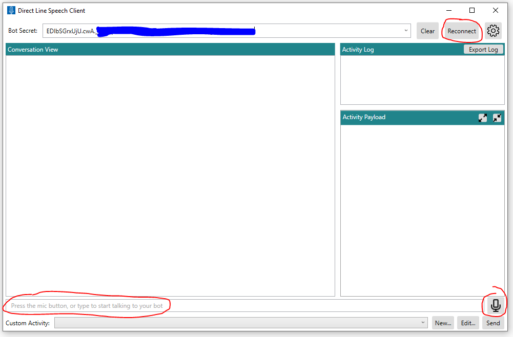
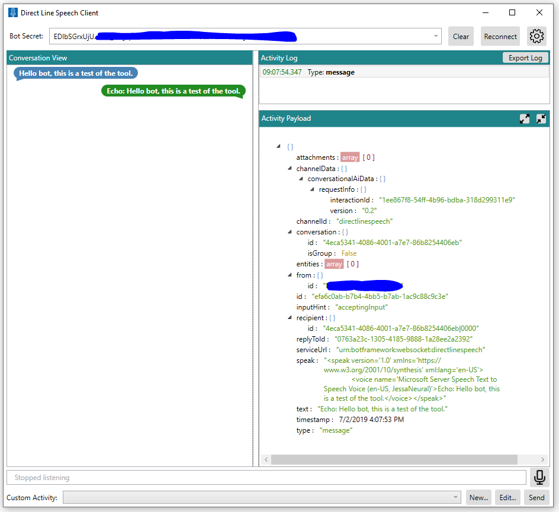

# Direct Line Speech Client
A Windows Presentation Foundation (WPF) application written in C#.  
Demonstrates usage of the [Speech SDK](https://docs.microsoft.com/en-us/azure/cognitive-services/speech-service/speech-sdk)
to manage voice communication with your Bot-Framework bot, 
after you register it with [Direct Line Speech](https://docs.microsoft.com/en-us/azure/bot-service/bot-service-channel-connect-directlinespeech?view=azure-bot-service-4.0)
channel. 
Provides an easy way to test voice interactions with your bot before writing your own client application.

## Features

* Fully configurable to support any bot registered with Direct Line Speech channel
* Typing text or speaking to the microphone as input to your bot
* Playback of the bot response
* Supports [custom wake-word](https://docs.microsoft.com/en-us/azure/cognitive-services/speech-service/speech-devices-sdk-create-kws)
* Supports sending custom [Bot-Framework Activities](https://github.com/Microsoft/botframework-sdk/blob/master/specs/botframework-activity/botframework-activity.md) in json format to your bot
* Displays [Adaptive Cards](https://adaptivecards.io/) sent from your bot (with some limitations)
* Exporting the transcript and activity log to a file 

## Getting Started

### Prerequisites

- Windows 10 PC
- Visual Studio 2017 or higher
- Microphone access
- An Azure [Speech Services Key](https://docs.microsoft.com/en-us/azure/cognitive-services/speech-service/get-started) for billing
- A [Bot-Framework](https://dev.botframework.com/) bot service registered with Direct Line Speech channel 

### Quickstart

1. git clone https://github.com/Azure-Samples/Cognitive-Services-Direct-Line-Speech-Client.git
2. cd Cognitive-Services-Direct-Line-Speech-Client
3. Open DLSpeechClient.sln in Visual Studio 2017 or higher and build the project 
4. Run the resulting executable (e.g. for Release x64 build: DLSpeechClient\bin\x64\Release\DLSpeechClient.exe)
5. When you first run the application, the Setting page will open (see "settings page" screen capture below). The first two fields must be entered (all others are optional):
    - Enter _Subscription key_. This is your Azure [Speech Services Key](https://docs.microsoft.com/en-us/azure/cognitive-services/speech-service/get-started) 
    - Enter _Subscription key region_. This is the Azure region of your key (e.g. "westus")
    - The default input language is "en-us" (US English). Update the _Language_ field as needed to select a different [language code from the "Speech-to-text" list](https://docs.microsoft.com/en-us/azure/cognitive-services/speech-service/language-support)  (e.g. enter "de-de" for German, without the quotes).
    - Press _Ok_ when you are done. 
    - Your entires will be saved and populated automatically when you launch the app again. 
6. In the main window, enter the "Bot Secret" (see "Main page" screen capture below). This is one of the two channel secret keys you got in the Azure website when you
registered your Bot-Framework bot with the Direct Line Speech channel. 
7. Press "Reconnect". The application will try to connect to your bot via Direct Line Speech channel. 
The message "New conversation started -- type or press the microphone button" will appear on the bottom text bar if connection
succeeded.
8. You will be prompted to allow microphone access. 
9. Press the microphone icon to begin recording. Say one utterance. While speaking, intermediate recognition results will be shown at the bottom bar. The microphone icon will turn red while recording is in progress. It will automatically detect you have done speaking and stop recording.
10. If everything works properly, you should see your bot's response on the screen as well as hear it speak to you.
You can click on lines in the Activity Log window to see the full activity payload from the bot in json format (see "Main page with activity" screen capture below).
Note that you will only hear the bot's voice response if the ["Speak" field](https://github.com/Microsoft/botframework-sdk/blob/master/specs/botframework-activity/botframework-activity.md) 
in the bot's output activity was set. 
 
### Screen Captures
#### Settings page
_Subscription key_ & _Subscription key region_ fields are required. Also enter _Lanauge_ for none en-us input 

#### Main page
Enter _Bot Secret_ (one of two Direct Line Speech channel secrets), press "Reconnect" and then press Mic icon to speak. 

#### Main page with activity
Showing the bot response, with its activity payload 

## Troubleshooting

See _Debugging_ section in [Voice-first virtual assistants Preview: Frequently asked questions](https://docs.microsoft.com/en-us/azure/cognitive-services/speech-service/faq-voice-first-virtual-assistants)

## Resources
- [Bot Framework](https://dev.botframework.com/) docs:
  - [About Direct Line](https://docs.microsoft.com/en-us/azure/cognitive-services/speech-service/get-started)
  - [Connect a bot to Direct Line Speech](https://docs.microsoft.com/en-us/azure/bot-service/bot-service-channel-connect-directlinespeech?view=azure-bot-service-4.0)
  - [Use Direct Line Speech in your bot](https://docs.microsoft.com/en-us/azure/bot-service/directline-speech-bot?view=azure-bot-service-4.0)
  - [Bot-Framework Activities](https://github.com/Microsoft/botframework-sdk/blob/master/specs/botframework-activity/botframework-activity.md)
- [Speech SDK](https://docs.microsoft.com/en-us/azure/cognitive-services/speech-service/speech-sdk) docs:
  - [About custom voice-first virtual assistants](https://docs.microsoft.com/en-us/azure/cognitive-services/speech-service/voice-first-virtual-assistants)
  - [Voice-first virtual assistants: Frequently asked questions](https://docs.microsoft.com/en-us/azure/cognitive-services/speech-service/faq-voice-first-virtual-assistants)
  - [Troubleshoot the Speech SDK](https://docs.microsoft.com/en-us/azure/cognitive-services/speech-service/troubleshooting)
  - [Quickstart: Create a voice-first virtual assistant with the Speech SDK, UWP](https://docs.microsoft.com/en-us/azure/cognitive-services/speech-service/quickstart-virtual-assistant-csharp-uwp)
  - [Quickstart: Create a voice-first virtual assistant with the Speech SDK, Java](https://docs.microsoft.com/en-us/azure/cognitive-services/speech-service/quickstart-virtual-assistant-java-jre)
  - [Quickstart: Create a voice-first virtual assistant in Java on Android by using the Speech SDK](https://docs.microsoft.com/en-us/azure/cognitive-services/speech-service/quickstart-virtual-assistant-java-android)
  - [Create a custom wake word by using the Speech service](https://docs.microsoft.com/en-us/azure/cognitive-services/speech-service/speech-devices-sdk-create-kws)
  - [Try Speech Services for free](https://docs.microsoft.com/en-us/azure/cognitive-services/speech-service/get-started)
  - [Language and region support for the Speech Services](https://docs.microsoft.com/en-us/azure/cognitive-services/speech-service/language-support) 
- [Adaptive Cards](https://adaptivecards.io/)
 
